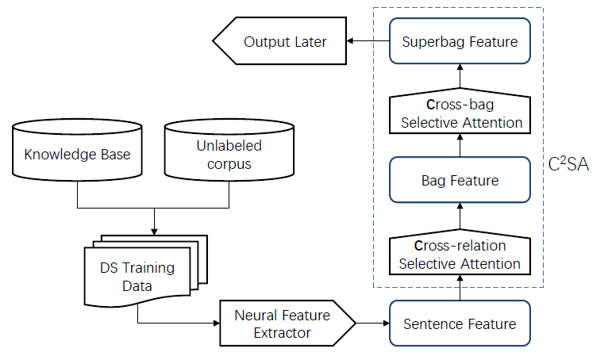

# Cross-relation Cross-bag Attention for Distantly-supervised Relation Extraction

Source code and data for [Cross-relation Cross-bag Attention for Distantly-supervised Relation Extraction] (https://arxiv.org/abs/1812.10604)

<p align="center"></p>
--------------------------------------------------------------------------------

Training relation extractor with Cross-relation Cross-bag Attention:
- employ the sentence-level selective attention to reduce the effect of noisy or mismatched sentences, while the correlation among relations were captured to improve the quality of attention weights.
- try to pay more attention to entity-pairs with a higher quality.

# Environment
Python 2.7
Pytorch 0.3.0

# Data
We include NYT dataset in the Data folder.

# Train
A demo is provided and can be execurated by:
```
python train.py
```

# Test
After training, the model will be saved in /model
```
python test.py
```

## Reference
Please cite the following paper if you find the codes useful:
```
@article{yuan2018cross,
  title={Cross-relation Cross-bag Attention for Distantly-supervised Relation Extraction},
  author={Yuan, Yujin and Liu, Liyuan and Tang, Siliang and Zhang, Zhongfei and Zhuang, Yueting and Pu, Shiliang and Wu, Fei and Ren, Xiang},
  journal={arXiv preprint arXiv:1812.10604},
  year={2018}
}
```